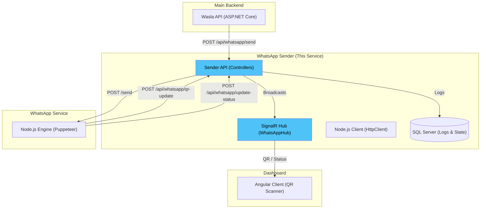

# WhatsApp Sender API — Orchestration Gateway

> A lightweight ASP.NET Core 8 API that acts as the orchestration layer between the Wasla backend, the Node.js WhatsApp engine, and the Angular dashboard.

This service is the **bridge** in the Wasla messaging pipeline. It exposes endpoints for the main backend to trigger WhatsApp messages, communicates securely with the Node.js service using shared tokens, logs all messaging activity to a SQL Server database, and pushes live QR code and connection status updates to the Angular client via SignalR.

---

## Table of Contents

- [Architecture](#architecture)
- [How It Works](#how-it-works)
- [Security Model](#security-model)
- [API Endpoints](#api-endpoints)
- [SignalR Hub](#signalr-hub)
- [Database Schema](#database-schema)
- [Configuration](#configuration)
- [Project Structure](#project-structure)

---

## Architecture



---

## How It Works

1. **OTP Request**: When a user registers on Wasla, the main backend generates an OTP and sends it to this gateway via `POST /api/whatsapp/send`.
2. **Logging**: The gateway immediately logs the message intent to its SQL Server database with a `Pending` status.
3. **Forwarding**: The gateway forwards the request to the Node.js engine.
4. **Delivery Status**: Based on the Node.js response, the gateway updates the database record to either `Sent` or `Failed`.
5. **Real-time Sync**: When the Node.js engine boots up or disconnects, it sends its QR code or status to this gateway, which instantly broadcasts it to the Angular dashboard via SignalR.

---

## Security Model

Because this service bypasses standard JWT user authentication (it operates server-to-server), it uses a **Shared Token Architecture**:

1. **`x-node-token` Header**: Every API request must include this header.
2. **`NodeTokenAuthAttribute`**: A custom ASP.NET Core Action Filter validates this header against the `NodeService:Token` configured in `appsettings.json`.
3. **Zero Trust**: If the token is missing or invalid, the request is rejected with `401 Unauthorized`.

---

## API Endpoints

All endpoints require the `x-node-token` header.

| Method | Path | Description |
|:--|:--|:--|
| POST | `/api/whatsapp/send` | Send a WhatsApp message |
| GET | `/api/whatsapp/status` | Check if the Node.js engine is ready |
| POST | `/api/whatsapp/qr-update` | Webhook: Node.js engine sends new QR code |
| POST | `/api/whatsapp/update-status` | Webhook: Node.js engine updates connection state |
| GET | `/api/whatsapp/logs` | Fetch paginated message delivery logs |
| GET | `/api/whatsapp/node-status` | Internal health check endpoint |

### Send Message Request

```json
{
  "phoneNumber": "201234567890",
  "message": "Your OTP: 123456"
}
```

---

## SignalR Hub

The service hosts a SignalR Hub at `/hubs/whatsapp` for the Angular dashboard.

### Events Emitted to Clients:

- `ReceiveQR` (string qrCode) — Emitted when a new QR code is generated.
- `ReceiveStatus` (bool isReady) — Emitted when the connection state changes.

---

## Database Schema

Uses Entity Framework Core with SQL Server.

### `MessageLogs` Table

| Column | Type | Description |
|:--|:--|:--|
| `Id` | INT (PK) | Auto-incrementing ID |
| `PhoneNumber` | NVARCHAR(20) | Target recipient |
| `MessageContent` | NVARCHAR(MAX) | The message sent |
| `SentAt` | DATETIME2 | Timestamp |
| `Status` | NVARCHAR(50) | `Pending`, `Sent`, or `Failed` |
| `ErrorMessage` | NVARCHAR(MAX) | Details if failed |

### `WhatsAppStatus` Table

| Column | Type | Description |
|:--|:--|:--|
| `Id` | INT (PK) | Always 1 (Single-row design) |
| `IsReady` | BIT | Connection state |
| `LastUpdated` | DATETIME2 | Timestamp of last state change |

---

## Configuration

| Env Variable | Description |
|:--|:--|
| `ConnectionStrings__DefaultConnection` | SQL Server connection string |
| `NodeService__BaseUrl` | URL of the Node.js WhatsApp engine |
| `NodeService__Token` | Shared secret for `x-node-token` |
| `AllowedHosts` | CORS configuration |

---

## Project Structure

```
whatsapp-sender/
├── WhatsAppServices.API/
│   ├── Controllers/         # WhatsAppController
│   ├── Hubs/                # SignalR WhatsAppHub
│   ├── Filters/             # NodeTokenAuthAttribute
│   ├── Services/            # INodeServiceClient, IWhatsAppLogService
│   ├── Data/                # ApplicationDbContext, Migrations
│   ├── DTO/                 # Data Transfer Objects
│   └── Middleware/          # ExceptionHandlingMiddleware
```
